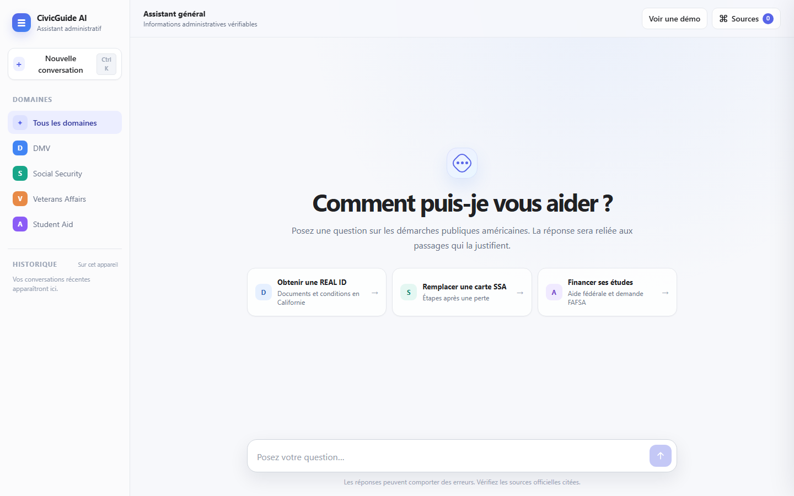
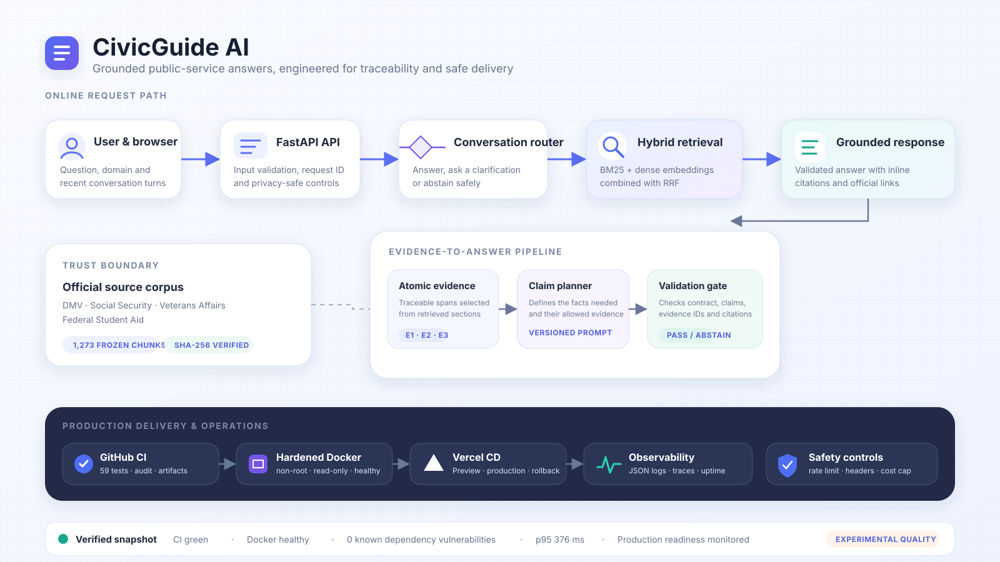

# CivicGuide AI

[](https://civicguide-ai-chatbot.vercel.app)
[](https://github.com/dhiarabaaoui/CivicGuide-AI-Chatbot/actions/workflows/ci.yml)
[](https://www.python.org/)
[](https://fastapi.tiangolo.com/)
[](LICENSE)

CivicGuide AI is an end-to-end retrieval-augmented generation (RAG) assistant
for public-service questions. It retrieves evidence from official documents,
plans the claims required by the answer, verifies them and returns a cited
response through a public conversational interface.

## Try the product

The public demonstration is available at
**[civicguide-ai-chatbot.vercel.app](https://civicguide-ai-chatbot.vercel.app)**.
It supports questions about DMV services, Social Security, Veterans Affairs and
federal student aid. The interface includes source inspection, multi-turn
conversation, domain selection, a free scripted demo and local chat history.

[](https://civicguide-ai-chatbot.vercel.app)

*Click the preview to open the live application. Generated answers remain
experimental and should be checked against the cited official source.*

## What the system does

| Capability | Implementation |
|---|---|
| Hybrid retrieval | BM25 lexical search + OpenAI embeddings, fused with Reciprocal Rank Fusion (RRF) |
| Conversation handling | Uses recent turns, detects follow-up questions and routes between answer, clarification and abstention |
| Evidence planning | Converts retrieved sections into atomic, traceable evidence before generation |
| Controlled generation | Planner → optional reviewer → realizer, using three versioned prompts |
| Grounding | Validates answer structure, evidence identifiers and inline citations before returning a response |
| Safety | Domain-mismatch guard, insufficient-evidence abstention, cost ceiling and safe fallback |
| Product experience | Responsive chat UI, interactive source drawer, animated demo and browser-local history |
| Operations | Structured logs, request IDs, health probes, feedback, uptime checks and rollback runbook |

## Architecture

[](docs/assets/architecture.svg)

The online path separates conversation routing, retrieval, evidence planning,
generation and validation. The delivery path independently verifies the same
frozen artifacts in GitHub Actions and Docker before Vercel serves them, while
health probes and privacy-safe logs observe the public runtime.

RRF, or **Reciprocal Rank Fusion**, combines result rankings rather than raw
scores. A passage receives a contribution close to `1 / (constant + rank)` from
each retriever, allowing lexical and semantic search to complement one another
without forcing their scores onto the same scale.

## Verified runtime snapshot

| Check | Result |
|---|---:|
| Indexed document chunks | **1,273** |
| Embedding dimensions | **1,536** |
| Automated tests | **59 passed** |
| Dependency audit | **0 known vulnerabilities** |
| Hardened Docker smoke test | **healthy** |
| Lexical load test | **40/40, 0 errors, p95 376 ms** |
| Public end-to-end smoke test | **PASS** |
| Domain answers in the smoke test | **4/4 with citations** |
| Deterministic clarification check | **PASS** |
| Smoke-test API cost | **$0.022777** |

The strongest closed 32-case regression reached 84.38% overall success, but it
was repeatedly used during development and is not presented as an independent
production estimate. On a separate 80-case automatically scored set, citation
validity and faithfulness were both 98.75%, while acceptable correctness was
67.50% and completeness was 33.75%. The system is therefore published as an
engineering and portfolio demonstrator, not as an authoritative government
service. Full context is recorded in [MODEL_CARD.md](MODEL_CARD.md).

## Repository map

```text
apps/                 FastAPI runtime and internal annotation utilities
configs/              retrieval, generation, runtime and release settings
frontend/             responsive HTML/CSS/JavaScript chat interface
notebooks/            eight retained research and evaluation notebooks
prompts/              the three active planner/reviewer/realizer prompts
rag_runtime/          retrieval, generation, validation and service code
runtime_artifacts/    frozen chunks, documents, vectors and searchable index
scripts/              preparation, evaluation, smoke-test and deployment tools
tests/                unit, integration, frontend and deployment checks
docs/assets/          curated visuals for GitHub
app.py                Vercel/FastAPI entry point
Dockerfile            non-root portable production image
compose.yaml          hardened local container runtime
OPERATIONS.md         monitoring, CI/CD, incident and rollback runbook
CHANGELOG.md          portfolio release history and verified release evidence
```

Historical prompt variants, rejected rerankers and redundant experiments were
removed from the active project. The retained path and cleanup rationale are
documented in [GUIDE_MEMOIRE_PROJET.md](GUIDE_MEMOIRE_PROJET.md) and
[CLEANUP_PROJECT.md](CLEANUP_PROJECT.md).

## Run locally

### 1. Create an environment

```powershell
python -m venv .venv
.\.venv\Scripts\Activate.ps1
python -m pip install --upgrade pip
pip install -r requirements-runtime.txt
```

### 2. Configure generation

```powershell
Copy-Item .env.example .env
```

Add your own `OPENAI_API_KEY` to `.env`. The file is ignored by Git. Without a
key, the application can still load its local artifacts and the scripted UI
demo, but generated answers are unavailable.

### 3. Start the application

```powershell
powershell -ExecutionPolicy Bypass -File scripts\run_rag_api.ps1
```

Open `http://127.0.0.1:8000`. Interactive API documentation is available at
`http://127.0.0.1:8000/docs`.

## API

| Endpoint | Purpose | OpenAI call |
|---|---|---|
| `GET /` | Serve the chat application | No |
| `GET /health` | Validate loaded artifacts and generation availability | No |
| `GET /health/live` | Lightweight process liveness probe | No |
| `GET /health/ready` | Deployment readiness and artifact probe | No |
| `POST /v1/retrieve` | Inspect retrieved chunks and evidence | Optional dense embedding |
| `POST /v1/chat` | Run routing, retrieval, planning, generation and validation | Yes for generated answers |
| `POST /v1/feedback` | Log a privacy-safe rating linked to a trace ID | No |

Lexical retrieval can be tested at no API cost by sending `use_dense: false` to
`POST /v1/retrieve`.

## Test the project

Run the complete automated suite without paid model calls:

```powershell
python -m unittest discover -s tests -p "test_*.py" -q
```

Run the same static and supply-chain controls used by CI:

```powershell
pip install -r requirements-dev.txt
ruff check app.py apps/rag_api.py rag_runtime tests scripts/load_test.py scripts/verify_runtime_artifacts.py
python scripts/verify_runtime_artifacts.py
python -m pip_audit -r requirements.txt --strict
```

Run the real end-to-end smoke test only after explicitly accepting its maximum
cost:

```powershell
python scripts/run_runtime_e2e_smoke.py `
  --maximum-cost-usd 0.12 `
  --confirm-maximum-cost-usd 0.12
```

Responses are cached, and the test writes a readable and machine-readable
report under `reports/generated/`.

## Run with Docker

The production image runs as a non-root user, contains no API key, exposes a
Docker health check and uses `/tmp` for ephemeral serverless-compatible state.

```powershell
docker compose build
docker compose up -d
```

Then open `http://127.0.0.1:8000`. A dependency-free lexical load test is
available with `python scripts/load_test.py`; it does not call OpenAI.

## Reproduce the research path

The public repository keeps only the notebooks that explain the selected path:

1. data analysis and validation;
2. structure-aware document chunking;
3. retrieval benchmark construction;
4. hybrid BM25 + dense retrieval with RRF;
5. traceable context construction;
6. error analysis and adjudication;
7. pre-production routing readiness;
8. automated end-to-end evaluation.

Generated datasets, caches and reports are intentionally excluded from Git.
Dataset provenance and citation information are in [DATA_CARD.md](DATA_CARD.md).

## Engineering choices

- frozen runtime candidate with SHA-256 manifests;
- pinned production dependencies and Python version;
- only three active and versioned generation prompts;
- local response cache and resumable paid evaluations;
- explicit per-request and per-run cost ceilings;
- no secrets in code, artifacts, logs or documentation;
- deterministic checks before any generated response is exposed;
- serverless-safe temporary writes on Vercel;
- honest reporting of failed quality targets and rejected variants.
- structured privacy-safe JSON logs and request correlation IDs;
- liveness/readiness probes, user feedback and scheduled uptime checks;
- dependency vulnerability scanning and automated update proposals;
- GitHub CI quality gates, container smoke tests and native Vercel Git CD;
- documented incident response and instant rollback procedure.

## Deployment

The application is deployed as a Python FastAPI project on Vercel. A
reproducible preparation script copies only the four runtime artifacts required
by the application and verifies their hashes and total size.

```powershell
python scripts/prepare_vercel_artifacts.py
vercel --prod
```

See [VERCEL_DEPLOYMENT.md](VERCEL_DEPLOYMENT.md) for the complete deployment and
post-deployment checklist. See [OPERATIONS.md](OPERATIONS.md) for CI/CD,
monitoring, Docker, incident response and rollback operations.

For a concise recruiter-oriented explanation of the problem, architecture,
trade-offs and verified outcomes, see the
[portfolio case study](docs/PORTFOLIO_CASE_STUDY.md).

## Responsible use

CivicGuide AI is not affiliated with a US government agency. It may return
incomplete, outdated or incorrect information. Users should follow the cited
official links before making administrative, legal, financial or benefits
decisions. Do not use the application for emergencies or as a substitute for a
qualified professional.

## License and attribution

Project code is available under the [MIT License](LICENSE). MultiDoc2Dial and
third-party source documents retain their original licenses and attribution;
see [DATA_CARD.md](DATA_CARD.md). If you use the dataset, cite the original
MultiDoc2Dial paper listed there.
